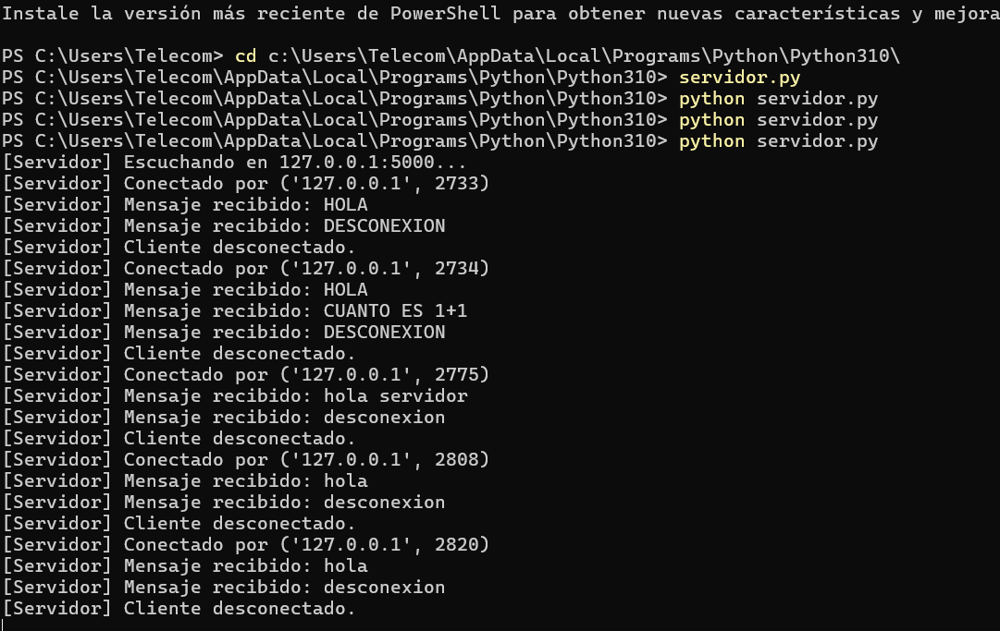
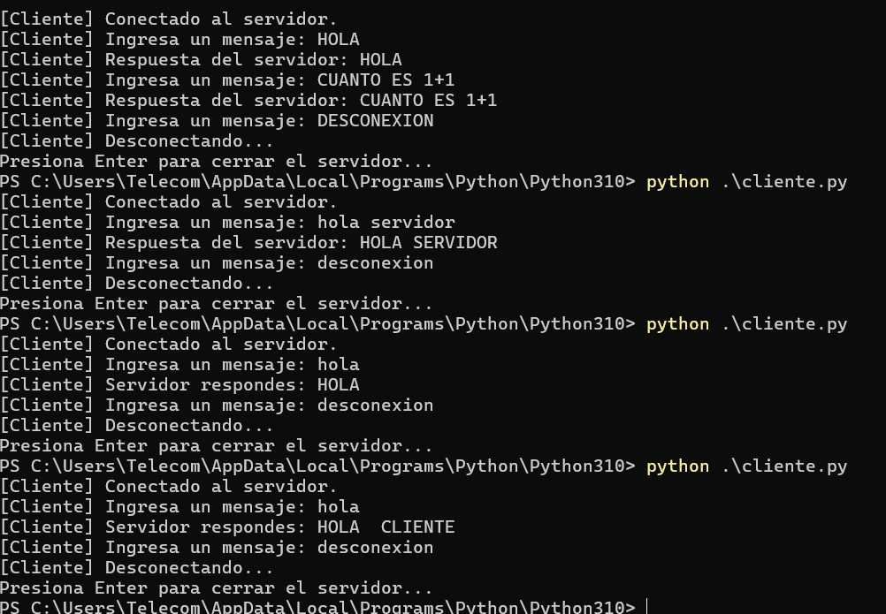

# TESTPYTHONTCP

Se genera servidor tcp

Pasos para ejecutar el servidor y el cliente
SERVIDOR
1.-clonar el repositorio
2.-importar los paquetes en este caso socket

3.- abrir en el cmd la ruta correcta y ejecutar un "python servidor.py"

CLIENTE

1.-clonar el repositorio
2.-importar los paquetes en este caso socket

3.- abrir en el cmd la ruta correcta y ejecutar un "python cliente.py"

Para ejecutar los tets 

SERVIDOR
1.-clonar el repositorio
2.-importar los paquetes en este caso socket

3.- ejecutar con un python test tcp.py
